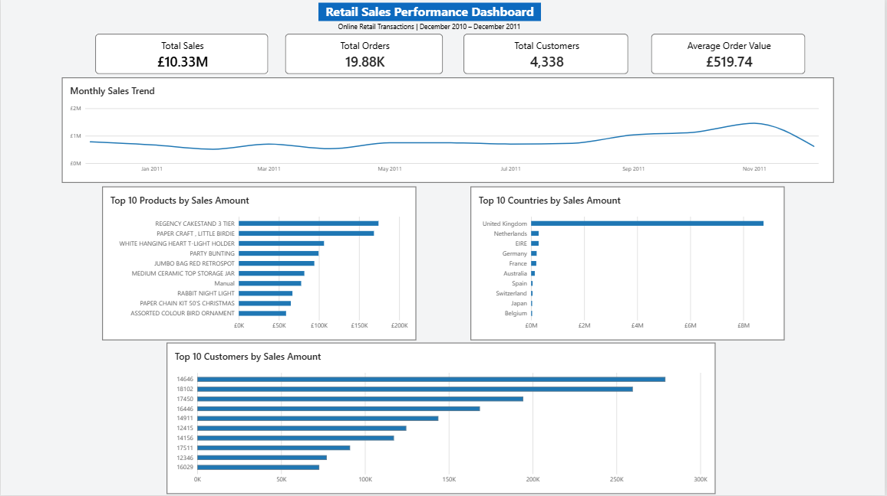

# Retail Sales Performance Analysis

## Project Overview

This project analyzes online retail transaction data to identify sales trends, top-performing products, key markets, and high-value customers.

The analysis combines Python for data cleaning and exploratory analysis with Power BI for interactive business visualization.

## Business Questions

This analysis aims to answer the following questions:

- How do sales change over time?
- Which products generate the highest sales?
- Which countries contribute the most to sales?
- Which customers generate the highest sales?
- What patterns can be observed in customer purchasing behavior?

## Dataset

The analysis uses the **Online Retail Dataset** from the UCI Machine Learning Repository.

Source: [UCI Machine Learning Repository – Online Retail Dataset](https://archive.ics.uci.edu/dataset/352/online+retail)

The dataset contains transaction-level records from a UK-based online retailer covering transactions from December 2010 to December 2011.

### Key variables

| Variable | Description |
|---|---|
| InvoiceNo | Transaction/invoice number |
| StockCode | Product code |
| Description | Product description |
| Quantity | Quantity purchased |
| InvoiceDate | Date and time of transaction |
| UnitPrice | Unit price |
| CustomerID | Customer identifier |
| Country | Customer's country |

## Data Preparation

The raw dataset contained **541,909 transaction records**.

The following data preparation steps were performed:

1. Removed duplicate records.
2. Identified missing values and assessed their impact.
3. Excluded transactions with negative quantities.
4. Excluded records with zero or negative unit prices.
5. Identified cancellation transactions.
6. Removed non-product transactions such as postage, fees, bad debt, adjustments, and discounts from product-level sales analysis.
7. Created a `SalesAmount` variable:

   `SalesAmount = Quantity × UnitPrice`

8. Validated the cleaned dataset before analysis.

## Key Performance Indicators

| KPI | Result |
|---|---:|
| Total Sales | £10.33M |
| Total Orders | 19,881 |
| Total Customers | 4,338 |
| Average Order Value | £519.74 |

## Key Findings

### Sales Trend

Sales varied considerably throughout the analysis period.

November 2011 recorded the highest monthly sales at approximately **£1.46M**, while February 2011 recorded the lowest at approximately **£509K**.

Sales increased substantially during the latter part of 2011 before declining in December. The December value should be interpreted with caution because the dataset only covers transactions through **December 9, 2011**.

### Product Performance

The highest-selling products by sales amount included:

1. REGENCY CAKESTAND 3 TIER
2. PAPER CRAFT, LITTLE BIRDIE
3. WHITE HANGING HEART T-LIGHT HOLDER
4. PARTY BUNTING
5. JUMBO BAG RED RETROSPOT

These products accounted for a substantial share of recorded product sales.

### Country Performance

The **United Kingdom** generated the largest sales amount by a substantial margin, followed by markets including the Netherlands, EIRE, Germany, and France.

This indicates that the business was heavily concentrated in its domestic UK market, while several European markets represented important international sales markets.

### Customer Performance

A relatively small number of customers generated substantial sales amounts.

The highest-sales customers included Customer IDs **14646, 18102, 17450, and 16446**.

Customer purchasing behavior varied considerably, with differences in both order frequency and average order value.

## Power BI Dashboard

The Power BI dashboard provides an interactive view of:

- Total Sales
- Total Orders
- Total Customers
- Average Order Value
- Monthly Sales Trend
- Top 10 Products by Sales Amount
- Top 10 Countries by Sales Amount
- Top 10 Customers by Sales Amount



## Tools Used

- **Python**
- **Pandas**
- **Matplotlib**
- **Jupyter / Google Colab**
- **Power BI**
- **GitHub**

## Project Workflow

```text
Raw Data
   ↓
Data Cleaning
   ↓
Data Validation
   ↓
Exploratory Data Analysis
   ↓
Business Metrics
   ↓
Power BI Dashboard
   ↓
Business Insights

## Limitations

- The dataset covers transactions from December 2010 to December 2011, with December 2011 containing only partial-month data.
- Customer-level analysis is limited to transactions with available CustomerID values.
- Sales analysis excludes cancellations, non-positive quantities, non-positive unit prices, and non-product transaction items such as postage and fees.
- The analysis is descriptive and does not establish causal relationships.

## Conclusion

This project demonstrates an end-to-end retail sales analysis workflow, from data cleaning and validation to exploratory analysis, business KPI development, and dashboard creation. The findings highlight monthly sales patterns, high-performing products and markets, and differences in customer purchasing activity.
